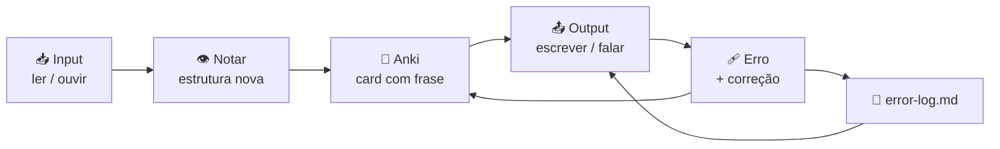

# 🧭 Guia de Estudo

> Como usar este repositório todo dia sem depender de motivação.

---

## 1. A ideia central

Inglês não melhora por acumular explicação. Melhora por passar por um ciclo fechado:
você recebe input, **nota** uma estrutura que não sabia, tenta **produzir** ela, erra,
corrige, e transforma esse erro em revisão espaçada.



Cada pasta deste repositório é uma etapa desse ciclo:

| Etapa | Arquivo | O que prova |
|-------|---------|-------------|
| 👁️ Notar | [`notes/`](notes/) | Você entendeu a regra a ponto de reescrever com suas palavras |
| 📤 Output | [`daily-logs/`](daily-logs/) · [`writing/`](writing/) | Você produziu, não só reconheceu |
| 🩹 Erro | [`error-log.md`](error-log.md) | Você sabe **por que** erra, não só que errou |
| 📊 Medição | [`PROGRESS.md`](PROGRESS.md) | Você tem dado, não sensação |
| ✅ Domínio | [`README.md`](README.md) | O checkbox só cai quando passa no teste de produção |

**O que falta na maioria dos estudos é a metade direita do diagrama.** Consumir aula é fácil.
Produzir, errar em público e catalogar o erro é o que move o nível.

---

## 2. O dia — 45 minutos

Quatro blocos, sempre na mesma ordem. A ordem importa: Anki primeiro porque é
o que você mais vai querer pular; output depois do estudo porque você precisa
de algo novo para tentar aplicar.

| ⏱️ | Bloco | O que fazer | Onde registra |
|----|-------|-------------|---------------|
| **15 min** | 🔁 **Anki** | Revisões pendentes primeiro. Só depois cards novos (até 20). | — |
| **15 min** | 📚 **Estudo ativo** | **Um** item do checklist do módulo atual. Um só. | [`notes/`](notes/) |
| **10 min** | ✍️ **Output** | 10 linhas usando o que acabou de estudar. | [`daily-logs/`](daily-logs/) |
| **5 min** | 🩹 **Fechamento** | Catalogar os erros do dia + `git commit`. | [`error-log.md`](error-log.md) |

### Variações honestas

Nenhum plano sobrevive a uma semana real de trabalho. Então tenha três versões:

<table>
<tr><th>🔴 Dia ruim — 15 min</th><th>🟢 Dia padrão — 45 min</th><th>🔵 Dia bom — 90 min</th></tr>
<tr valign="top">
<td>

- Anki: só revisões (10 min)
- 3 linhas no daily log (5 min)

**Zero cards novos. Zero culpa.**
O objetivo é só não quebrar a corrente.

</td>
<td>

Os 4 blocos acima.

Este é o dia que constrói o nível.

</td>
<td>

Os 4 blocos +

- 20 min listening ativo
- 20 min leitura
- ou 1 sessão de fala

</td>
</tr>
</table>

> ⚠️ **Não compense.** Perdeu terça? Quarta continua sendo 45 min, não 90.
> Estudo dobrado no dia seguinte é a forma mais comum de abandonar em 3 semanas.

### O commit é o ritual de fechamento

Você é dev — use isso. **Um commit por dia de estudo.** O gráfico de contribuições
do GitHub vira seu tracker de consistência, sem app nenhum.

```bash
git add . && git commit -m "day 12: present perfect + daily log" && git push
```

Dia sem commit = dia que não aconteceu. É brutal e é exatamente por isso que funciona.

---

## 3. A semana

| Dia | Foco |
|-----|------|
| **Seg–Sex** | Ciclo diário completo (45 min) |
| **Sáb** | 🔍 **Revisão semanal** — 60 min. O dia mais importante. |
| **Dom** | 📥 Input puro e leve: série, podcast, YouTube. Sem caderno. Ou folga total. |

### O sábado — protocolo de revisão

Este é o dia que separa quem evolui de quem só acumula horas.

1. **Releia o [`error-log.md`](error-log.md) inteiro** (15 min)
   Erro que apareceu 3x ou mais → move para a tabela de **Reincidentes** e vira card no Anki.
   Erro que sumiu há 4 semanas → move para **Superados**. Essa lista é a sua prova de evolução.

2. **Escreva um texto de 150 palavras** (25 min) → [`writing/`](writing/)
   Declare no topo **3 estruturas novas** da semana que você vai aplicar de propósito.
   Auto-revise antes de pedir qualquer correção.

3. **Preencha a semana no [`PROGRESS.md`](PROGRESS.md)** (10 min)
   Números reais. Semana ruim se registra igual — gráfico honesto é o que serve.

4. **Marque os checkboxes que passaram no teste** (10 min) → [`README.md`](README.md)
   Regra abaixo. Sem autoindulgência.

---

## 4. Como estudar cada coisa

Os 15 minutos de "estudo ativo" mudam de protocolo conforme o tipo de item.

<details open>
<summary><b>🔤 Gramática</b> — Módulos 1A, 2, 5</summary>

<br>

1. **Leia a explicação uma vez.** (4 min) Uma. Reler é a ilusão de aprender.
2. **Feche tudo e escreva a regra com suas palavras.** (3 min) Se não conseguir, você não entendeu — releia.
3. **Escreva 3 exemplos sobre a sua vida real.** (5 min)
   Não copie os do livro. *"I have worked with Node for three years"* vale 10x mais que *"She has lived in London"*.
4. **Contraste.** (3 min) Com qual estrutura isso se confunde? Escreva o par lado a lado.
   `Present Perfect` vs `Past Simple` só existe na sua cabeça quando você vê os dois juntos.

Tudo isso vai para [`notes/grammar/`](notes/grammar/).

> 🚫 **Não faça exercício de múltipla escolha.** Ele testa reconhecimento.
> Você precisa de produção: escrever a frase do zero.

</details>

<details>
<summary><b>📚 Vocabulário</b> — Módulos 1B, 6, 7</summary>

<br>

**Palavra isolada não gruda.** Só entra no Anki o que você encontrou em contexto real —
lendo, ouvindo, ou tentando escrever e travando.

Formato de card que funciona:

```
Frente:  I need to ______ up with the team before Friday.
         (= colocar em dia / sincronizar)
Verso:   catch
         → "I'll catch up with you after the meeting."
```

Formato que **não** funciona:

```
Frente:  catch up
Verso:   colocar em dia
```

O segundo testa tradução. O primeiro testa produção em contexto — que é o que você
precisa numa daily.

**Regra prática:** 20 cards novos/dia é o teto do README, não a meta. Se a retenção
cair abaixo de 85%, baixe para 10 até estabilizar. Anki punido vira Anki abandonado.

</details>

<details>
<summary><b>🔊 Listening</b> — Módulo Extra, 8</summary>

<br>

**Shadowing** — o exercício de maior retorno para sotaque e fluência. 15 min:

1. Escolha **30 segundos** de áudio nativo. Trinta. Não 5 minutos.
2. Ouça 3x sem texto. Só absorvendo o ritmo.
3. Ouça com transcrição, marcando onde o som ≠ o que está escrito
   (*"want to" → "wanna"*, *"did you" → "didja"*).
4. Fale **junto** com o áudio, 5–10x, imitando entonação e pausas — não só as palavras.
5. Grave você falando sozinho. Compare com o original. Anote a diferença.

**Dictation** — 5 min: transcreva 30s de áudio sem olhar o texto, depois compare.
Cada palavra que você errou é um som que seu ouvido ainda não separa. Isso é ouro
para o [`error-log.md`](error-log.md) na categoria `pronunciation`.

</details>

<details>
<summary><b>📖 Leitura</b> — Módulo 3</summary>

<br>

**Não pare no dicionário.** Leia a página inteira marcando palavras desconhecidas
sem consultar nada. Só no fim você olha — e só as que apareceram 2x ou que bloquearam
o sentido. As outras você deduz ou ignora.

Após cada texto, responda em inglês, por escrito:
- Qual é a ideia principal em **uma frase**?
- O autor é a favor, contra ou neutro? Que palavra específica revela isso?
- Que estrutura gramatical apareceu que você **não** usaria naturalmente?

A terceira pergunta é a que gera material para o Anki.

**Progressão:** graded reader → artigo técnico (você já conhece o assunto, o que reduz
a carga) → jornalismo (*The Guardian*, *BBC*) → livro real.

</details>

<details>
<summary><b>🗣️ Speaking</b> — Módulos 7, 8</summary>

<br>

Você não precisa de interlocutor para começar. Precisa de gravador.

**Diário — 5 min:** grave-se falando 2 minutos sobre o que fez hoje.
Ouça de volta. Anote onde travou e **o que você quis dizer e não conseguiu**.
Essa lista define o vocabulário da semana seguinte.

**Semanal:** tutor ou nativo (italki, Cambly, Tandem). Mínimo 8 sessões no Módulo 8.

**Para a daily stand-up (Módulo 7)** — decore os blocos, não o script:
> *"Yesterday I worked on… Today I'm going to… I'm blocked by…"*
> *"Sorry, could you repeat that?" · "Just to make sure I got it right — you mean…?"*

Travar é normal e continua acontecendo em C1. O que muda é a velocidade de recuperação.

</details>

---

## 5. A regra do checkbox

> **Nunca marcar por reconhecer — só por conseguir produzir.** *(Regra #3 do README)*

Na prática, o teste por tipo:

| Tipo | ✅ Só marque quando |
|------|--------------------|
| **Gramática** | Escrever 5 frases próprias corretas, sem consultar, **e** explicar a regra em voz alta |
| **Vocabulário** | Usar a palavra numa frase sua — não traduzi-la |
| **Listening** | Entender em velocidade normal, sem legenda, na primeira vez |
| **Leitura** | Ler sem tradutor e conseguir resumir em inglês |
| **Escrita** | Produzir o texto e a correção externa não achar o erro que você mira |
| **Fala** | Sustentar 2 min sem travar mais de 2x |

Marcar cedo demais não engana ninguém além de você — e cobra juros no simulado.
Na dúvida, **não marque**. O checkbox não vai a lugar nenhum.

---

## 6. Erros de método que custam meses

| 🚫 | ✅ |
|----|----|
| Múltipla escolha e achar que treinou | Escrever a frase do zero |
| Card `palavra → tradução` | Card cloze com frase real |
| Assistir aula e marcar o checkbox | Produzir e passar no teste |
| Pular o error-log ("eu lembro") | Você não lembra. Por isso o arquivo existe. |
| Traduzir mentalmente do português | Aceitar ambiguidade e seguir lendo |
| Esperar "estar pronto" para falar | Falar errado hoje, gravado |
| Trocar de método toda semana | 8 semanas no mesmo antes de julgar |
| Estudar 4h no domingo | 45 min × 5 dias |

O penúltimo é o mais caro. Todo método decente funciona se você ficar tempo suficiente
nele; nenhum funciona em 4 dias.

---

## 7. Sua primeira semana — concreta

| Dia | O que fazer | Fecha com |
|-----|-------------|-----------|
| **1** | Módulo 0: horário fixo, Anki instalado, 2 decks criados, dicionário escolhido | `git commit` |
| **2** | Módulo 0: sistema/celular/IDE em inglês, extensão de tradução | `git commit` |
| **3** | Módulo 0: definir métrica semanal → primeira entrada no [`PROGRESS.md`](PROGRESS.md) ✅ **Módulo 0 fechado** | `git commit` |
| **4** | 1A: verbo *to be* → [`notes/grammar/`](notes/grammar/) + **daily log #1** | `git commit` |
| **5** | 1A: Present Simple vs Continuous + daily log #2 | `git commit` |
| **6** | 🔍 Sábado: revisão semanal completa (protocolo da seção 3) | `git commit` |
| **7** | Input leve. Uma série com legenda em inglês. Sem caderno. | — |

Depois disso, o ciclo se repete. A única coisa que muda é o item do checklist.

---

## 8. Como saber se está funcionando

Não confie em sensação — ela mente nos dois sentidos. Olhe o [`PROGRESS.md`](PROGRESS.md)
a cada 4 semanas:

| Sinal | Significado |
|-------|-------------|
| 📉 Novos erros/semana **caindo** com output constante | ✅ Funcionando |
| 📈 Palavras escritas/semana **subindo** | ✅ Funcionando |
| 🩹 Tabela de **Superados** crescendo | ✅ O melhor sinal que existe |
| ⚠️ Dias de estudo < 4/7 por 3 semanas | A rotina está grande demais — corte para 30 min |
| ⚠️ Retenção Anki < 80% | Cards ruins (tradução) ou volume alto — reformule e baixe para 10/dia |
| ⚠️ Zero erros novos há semanas | Você parou de produzir, ou o material está fácil demais |

O último é traiçoeiro: **ausência de erro não é domínio, é ausência de tentativa.**
Se o error-log parou de crescer, o problema quase nunca é você ter ficado bom.

---

## 9. Ferramentas

| Para | Ferramenta |
|------|-----------|
| Revisão espaçada | **Anki** (desktop + AnkiWeb) |
| Dicionário monolíngue | **Cambridge** ou **Longman** — nunca PT↔EN depois do Módulo 1B |
| Collocations | **Ozdic** · **Linguee** (para ver a palavra em contexto real) |
| Pronúncia | **YouGlish** (a palavra em vídeos reais) · **Forvo** |
| Correção de escrita | **LanguageTool** · **DeepL Write** — depois da auto-revisão, nunca antes |
| Conversa | **italki** · **Cambly** · **Tandem** |
| Input técnico | Docs oficiais · **Fireship** · **ThePrimeagen** · podcast *Syntax* |

> 💡 Ferramenta de correção **depois** da auto-revisão. Se você joga o texto no
> corretor antes de revisar, você terceirizou justamente a habilidade que quer construir.

---

<p align="center">
  <b>Consistência &gt; intensidade. Produção &gt; reconhecimento. Erro catalogado &gt; erro esquecido.</b>
</p>
